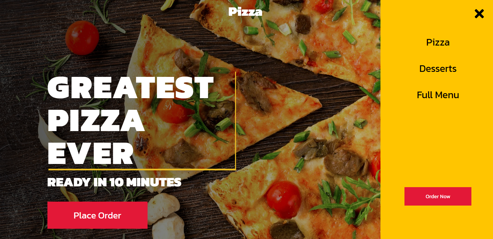
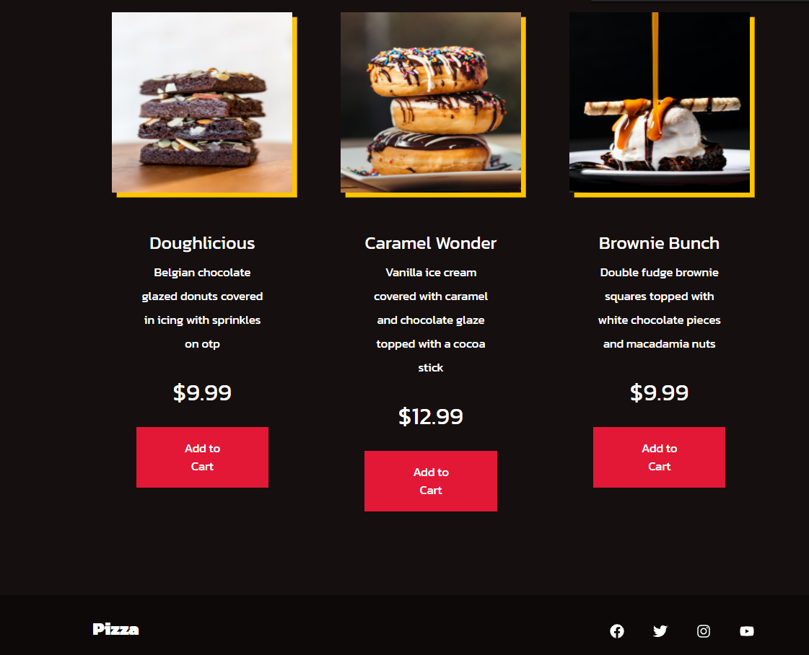

<h1>:pizza: React Pizza</h1>

*Ecommerce template built using React and styled-components*
  

[Visit Site](https://nikkipeel.github.io/react-pizza)
 

:gem: **Features:**
- Mobile-responsive
- Slide-out menu
- Grid layout for display products

### Hero Section &darr;

 

### Navigation &darr;

 

### Menu &darr;

 

### Featured/Specials &darr;

 

### Desserts &darr;

 

